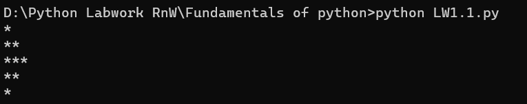

# First Python Project

## Description

This is my first Python project where I created a simple pattern using the `print()` function. The program displays a diamond-like pattern made of asterisks (*) by utilizing the newline character (`\n`) within a single print statement.

### Key Learnings

- **Print Function**: Learned how to display output to the console using the `print()` function
- **Escape Sequences**: Used `\n` (newline character) to create line breaks within a string

## Features

- ✅ Output display using print function
- ✅ Pattern creation using asterisks


## Output Screenshot



*The program creates a diamond pattern with asterisks*

## How to Run

1. Make sure Python is installed on your system
2. Save the code as `LW1.1.py`
3. Open terminal/command prompt
4. Navigate to the project directory
5. Run the command:
   ```bash
   python LW1.1.py
   ```

## What I Learned

This simple program taught me the fundamentals of:
- Using the `print()` function effectively
- Working with escape sequences to format output
- Creating visual patterns with code
- Understanding how Python interprets special characters in strings

## Author

Your Name

## Date

January 2026